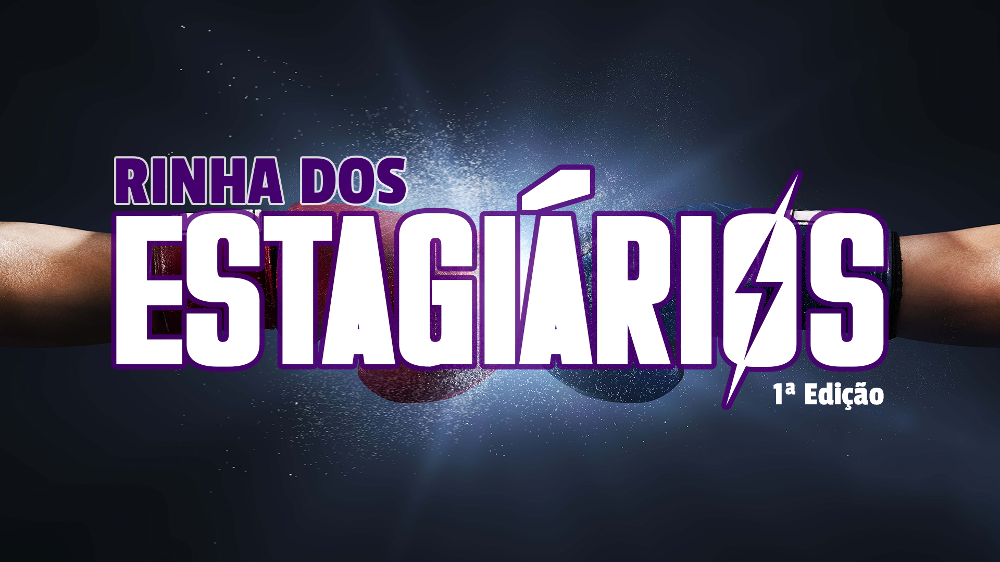

# Rinha dos Estagiários

O projeto "_Rinha dos Estagiários_" consiste em uma disputa Front-End.

O candidato deve reproduzir o layout proposto o mais fiel possível, o projeto deve ser/ter Semântico, Resposivo, SEO, Acessibilidade, 1 formulário com validação.
_Opcionalmente pode ser usado frameworks css_.

### Pré-requisitos:
1. Entrar em nosso server do Discord: [Clique aqui](https://discord.gg/gmAtecFxvu)
2. Segui nosso canal na Twitch: [classFerreiraCode](https://twitch.tv/classferreiracode)
3. Conhecimentos de **HTLM, CSS, JAVASCRIPT, GIT e GITHUB**

### PRÊMIO:
* Selo VIP na Twitch (Dando acesso a lives e conteúdos exclusivos)
* Cargo de Mentorado permanente no Discord (Acesso a mentores prontos para tirar suas dúvidas)
* Por ultimo mais não menos importante uma **indicação para o mercado de trabalho** (A indicação não é garantia de conquistar uma vaga de emprego)

## INSCRIÇÕES ENCERRADAS 10/04

ENTREGA DO PROJETO **21/04** 

OVERVIEW DOS PROJETOS ENTREGUE EM LIVE **24/04**

RESULTADO EM LIVE: **26/04**

 
 

### DICAS DE ESTUDOS

* [TechGuide.sh Alura](https://techguide.sh/pt-BR/path/front-end/) - Português
* [Frontend Developer RoadMap](https://roadmap.sh/frontend?r=frontend-beginner) - Inglês
* [Figma - Fundamentos](https://medium.com/nerdzao/o-que-%C3%A9-o-figma-e-por-que-usar-ele-a71fbf1dbdd8)
