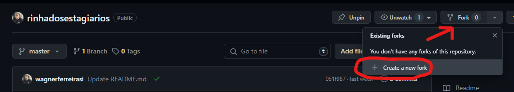
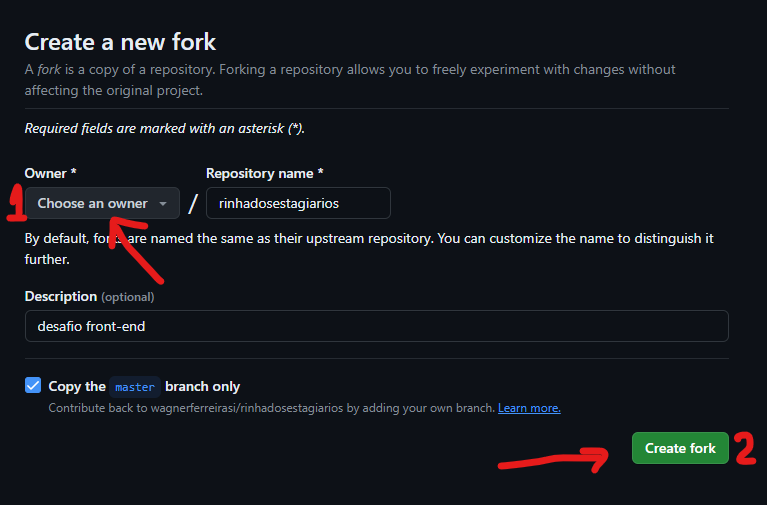
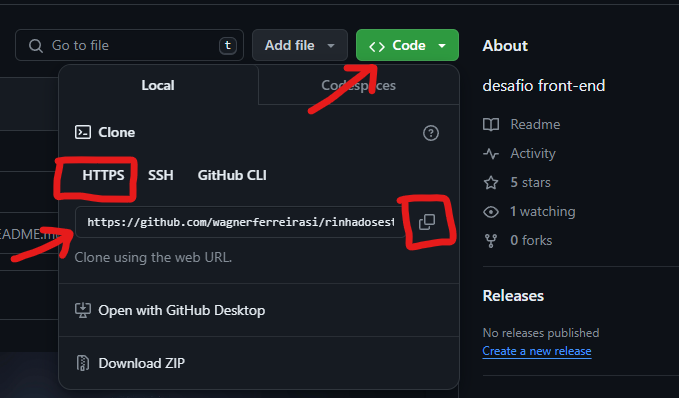

# COMO ACESSO O LAYOUT E ENVIO MEU PROJETO

## 1. Bifurcar um repositório

1.  Navegue até o projeto `rinhadosestagiarios` no [GitHub](https://github.com/wagnerferreirasi/rinhadosestagiarios)

2.  No canto superior direito da página, clique em Criar Fork ou Create new fork.
    

3.  Em "Proprietário", selecione o menu suspenso e clique em um proprietário do repositório com fork.

4.  Por padrão, os forks são nomeados da mesma forma que os respectivos repositórios pai. Opcionalmente, para distinguir ainda mais o fork, no campo "Nome do repositório", digite um nome.

5.  Opcionalmente, no campo "Descrição", digite uma descrição do fork.

6.  Opcionalmente, selecione Copiar somente o branch PADRÃO.

        Para muitos cenários de bifurcação, como contribuir para projetos de código aberto, você só precisa copiar o branch padrão. Se você não selecionar essa opção, todos os branches serão copiados para o novo fork.

7.  Clique em Criar bifurcação.
    

 
 

## 2. Clonando uma bifurcação

Você criou com sucesso o repositório `rinhadosestagiarios` mas, até agora, ele só esta no GitHub. Para poder trabalhar no projeto, você deverá cloná-lo para o seu computador.

    Você pode clonar a sua bifurcação com a linha de comando, GitHub CLI ou GitHub Desktop.

1.  No GitHub, navegue até o **seu fork** do repositório `rinhadosestagiarios`

2.  Acima da lista de arquivos, clique em <> Código.

3.  Copie a URL do repositório.
    

4.  Abra Terminal do seu computador.

5.  Altere o diretório de trabalho atual para o local em que deseja ter o diretório clonado.

6.  Digite `git clone` e cole a URL já copiada. Ela terá esta aparência, com seu nome de usuário do GitHub:

        https://github.com/wagnerferreirasi/rinhadosestagiarios.git

7.  Pressione Enter. Seu clone local será criado.

    > $ git clone https://github.com/wagnerferreirasi/rinhadosestagiarios 
    > Cloning into `rinhadosestagiarios`... 
    > remote: Counting objects: 10, done. 
    > remote: Compressing objects: 100% (8/8), done. 
    > remove: Total 10 (delta 1), reused 10 (delta 1) 
    > Unpacking objects: 100% (10/10), done. 

 
 

## 3. Como criar uma branch

    Antes de fazer alterações no projeto, você deve criar um branch e fazer check-out. Mantendo as alterações no próprio branch, você segue o GitHub Flow e garante que será mais fácil contribuir com o mesmo projeto novamente no futuro

> git branch BRANCH-NAME 
> git checkout BRANCH-NAME

 
 

## 4. Fazendo e enviando por push as alterações

    Dentro do diretorio Participantes crie um diretorio com seu nome de usuário do GitHub, onde vai desenvolver seu projeto

Quando estiver pronto para enviar suas alterações, teste e faça commit das suas alterações. `git add .` informa o Git de que você deseja incluir todas as alterações no próximo commit. `git commit` cria um instantâneo dessas alterações.

> git add . 
> git commit -m "descricao do seu commit"

No momento, suas alterações existem apenas localmente. Quando estiver pronto para fazer push das suas alterações para GitHub, faça push delas para o controle remoto.

> git push

## 5. Fazendo um pull request

    Finalmente, você está pronto para enviar o seu projeto para avaliação no projeto principal! Essa é a última etapa para entregar seu projeto, e a mais importante, indiscutivelmente.

1.  Para fazer isso, acesse o repositório no seu GitHub. Neste exemplo, ele estará em `https://github.com/<your_username>/rinhadosestagiarios`. Você verá uma notificação indicando que o branch está um commit à frente de rinhadosestagiarios:main. Clique em Contribuir e em Abrir uma solicitação de pull.

        O GitHub levará você para uma página que mostra as diferenças entre o fork e o repositório wagnerferreirasi/rinhadosestagiarios. Clique em Criar solicitação de pull

2.  GitHub levará você a uma página onde você pode inserir um título e uma descrição das suas alterações. Por fim, clique em Criar solicitação de pull.
